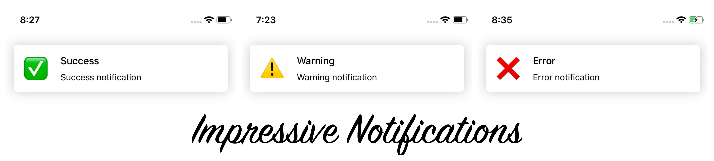

[](https://github.com/Carthage/Carthage)


## Description

**ImpressiveNotifications** are custom in-app notifications with 3 types of layouts. The notifications will animate in and out. They will hide when they are clicked on or with an automatic dismissal. It is also available to add custom behavior when notification is tapped. 

## Installation

**ImpressiveNotifications** is available through [Carthage](https://github.com/Carthage/Carthage).
To install just write into your Cartfile:

```ruby
github "impresyjna/ImpressiveNotifications"
```

**ImpressiveNotifications** is also available through [CocoaPods](http://cocoapods.org). To install
it, simply add the following line to your Podfile:

```ruby
pod 'ImpressiveNotifications', :git => 'https://github.com/impresyjna/ImpressiveNotifications', :branch => 'master'
```

## Usage
Call ``INNotifications.show`` with a type, data structure and customStyle if you want. Only type is necessary. 

Built-in notification types are :
```.success```
```.warning```
```.danger```
```.custom(UIView)```

Example: 

```swift
INNotifications.show(type: .danger, data: INNotificationData(title: "Error", description: "Error notification"))
```

## Configuration
**ImpressiveNotifications** gives user possibility to customize view.

### Custom style
``INNotificationStyle`` is the structure created to customize the appearance of notification. 
```swift 
public struct INNotificationStyle {
    let cornerRadius: CGFloat?
    let backgroundColor: UIColor?
    let titleColor: UIColor?
    let descriptionColor: UIColor?
    let imageSize: CGSize?
}
```
Example: 

```swift
INNotifications.show(type: .danger, data: INNotificationData(title: "Error", description: "Error notification"), customStyle: INNotificationStyle(cornerRadius: 10.0, backgroundColor: .black, titleColor: .red, descriptionColor: .yellow, imageSize: CGSize(width: 100.0, height: 100.0)))
```
### Custom data, time and completionHandler 
``INNotificationData`` is the structure created to customize data on the notification, time and add completionHandler on tap 
```swift
public struct INNotificationData {
    let title: String
    let description: String?
    let image: UIImage?
    let delay: TimeInterval
    let completionHandler: (() -> Void)?
}
```

Example: 

```swift
INNotifications.show(type: .danger, data: INNotificationData(title: "Danger", description: "Danger notification", image: UIImage(named: "danger"), delay: 20.0, completionHandler: {
            print("Hello")
    } 
))
```

### Custom view 
It is also possible to add custom view created for example in storyboard. 

Example: 

```swift
let storyboard = UIStoryboard(name: "Main", bundle: nil)
let vc = storyboard.instantiateViewController(withIdentifier: "CustomViewController")

INNotifications.show(type: .custom(vc.view))
```
